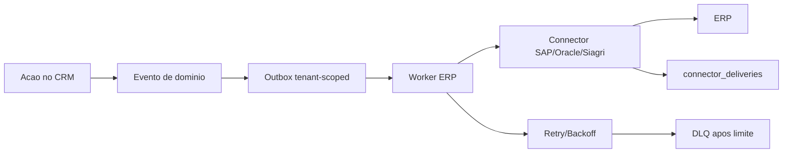
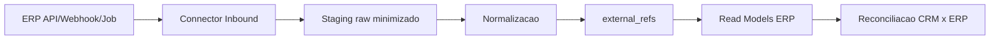
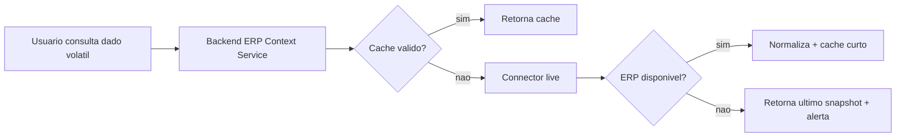

# Plano de Implementacao - ERP Hub Hibrido

Data: 2026-04-30
Projeto: Agro CRM SaaS
Escopo: amadurecimento do ERP Hub para conectores SAP, Siagri Agribusiness e Oracle
Status: planejamento executivo e tecnico para novas sprints

## 1. Objetivo

Evoluir o ERP Hub para um modelo profissional de integracao hibrida, seguro, auditavel e preparado para operacao SaaS multi-tenant.

O modelo hibrido combina:

- Sincronizacao interna para dados estaveis ou frequentemente consultados.
- Consulta live controlada para dados volateis ou sensiveis ao tempo.
- Outbox duravel para envio de eventos do CRM para ERPs.
- Inbound/webhooks/jobs para trazer dados dos ERPs para o CRM.
- Observabilidade operacional com retries, DLQ, circuit breaker, logs e reconciliacao.

O tema Agentes de IA fica fora do escopo destas sprints. A integracao ERP deve ser amadurecida primeiro; depois os agentes poderao consumir contexto ERP ja governado pelo backend.

## 2. Estado Atual Do Projeto

Ja existe uma base funcional do ERP Hub:

- Tela `ERP - Hub de Integracao`.
- Conectores iniciais:
  - SAP S/4HANA.
  - Oracle EBS.
  - Siagri Agribusiness.
- Configuracao tenant-scoped em `connector_configs`.
- Outbox duravel em `outbox_events`.
- Historico de entregas em `connector_deliveries`.
- Dead-letter queue em `dead_letter_queue`.
- Circuit breaker por vendor.
- Simulator interno para testes.
- Permissoes:
  - `erp.view`
  - `erp.test_connector`
  - `erp.configure`
  - `erp.retry`

Arquivos principais:

- `backend/modules/integrations/connectors.py`
- `backend/modules/integrations/routes.py`
- `backend/modules/integrations/worker.py`
- `backend/modules/integrations/circuit_breaker.py`
- `frontend/src/pages/ERP.jsx`
- `backend/core/db.py`

## 3. Decisao Arquitetural

Adotar modelo hibrido:

```text
CRM -> Outbox -> Connector -> ERP
ERP -> Connector Inbound / Job / Webhook -> Staging -> Normalizacao -> CRM Read Models
```

### 3.1 Por que hibrido

Somente sincronizacao:

- Boa performance e baixo acoplamento.
- Mas pode ficar defasada para dados como estoque, limite de credito, cotacao, status financeiro e saldo.

Somente consulta live:

- Dados sempre atuais.
- Mas aumenta latencia, custo operacional, dependencia do ERP e risco de indisponibilidade.

Modelo hibrido:

- Dados operacionais estaveis ficam em cache/snapshot local.
- Dados volateis sao consultados live com timeout, cache curto e circuit breaker.
- A UI continua responsiva mesmo se um ERP estiver instavel.
- A auditoria consegue rastrear origem, horario e qualidade do dado.

## 4. Principios Obrigatorios

1. O ERP nunca deve ser acessado diretamente pelo frontend.
2. Credenciais de ERP nunca devem ficar no bundle frontend.
3. Cada tenant deve ter sua propria configuracao de conector.
4. Todo dado inbound deve carregar `tenant_id`.
5. Todo dado operacional deve carregar `branch_id` quando aplicavel.
6. Toda chamada externa deve ter timeout, retry controlado, circuit breaker e logs.
7. Webhooks devem ser autenticados, assinados ou validados por segredo.
8. Payloads sensiveis devem ser minimizados em logs e auditoria.
9. Falhas devem ir para DLQ ou fila de reconciliacao, nunca sumir silenciosamente.
10. O ERP Hub deve expor status operacional claro para suporte/admin.

## 5. Modelo De Dados Proposto

### 5.1 `connector_configs`

Ja existe, mas deve ser amadurecida.

```js
{
  id,
  tenant_id,
  vendor, // sap, siagri, oracle
  enabled,
  environment, // sandbox, homologation, production
  base_url,
  auth_type, // api_key, oauth2_client_credentials, basic, mTLS, custom
  secret_ref, // referencia segura ao segredo, nao o segredo em texto puro
  headers_whitelist,
  rate_limit_policy,
  timeout_ms,
  retry_policy,
  circuit_breaker_policy,
  sync_policy,
  created_at,
  updated_at,
  updated_by
}
```

### 5.2 `erp_sync_state`

Controle incremental por entidade.

```js
{
  id,
  tenant_id,
  vendor,
  entity, // clients, products, contracts, orders, invoices, stock, finance
  branch_id,
  last_cursor,
  last_synced_at,
  last_success_at,
  last_error,
  status, // idle, running, failed, paused
  records_read,
  records_written,
  created_at,
  updated_at
}
```

### 5.3 `erp_external_refs`

Mapa entre ids internos do CRM e ids do ERP.

```js
{
  id,
  tenant_id,
  branch_id,
  vendor,
  entity,
  crm_id,
  crm_seq_id,
  erp_id,
  erp_code,
  erp_payload_hash,
  source_of_truth, // crm, erp, shared
  last_seen_at,
  created_at,
  updated_at
}
```

### 5.4 `erp_snapshots`

Read model local para contexto e consultas rapidas.

```js
{
  id,
  tenant_id,
  branch_id,
  vendor,
  entity,
  external_id,
  normalized,
  raw_minimized,
  source_updated_at,
  synced_at,
  quality_flags
}
```

Exemplos de entidades:

- `erp_customers`
- `erp_products`
- `erp_contracts`
- `erp_orders`
- `erp_invoices`
- `erp_payables`
- `erp_receivables`
- `erp_stock`
- `erp_credit_limits`
- `erp_exchange_rates`

### 5.5 `erp_reconciliation`

Divergencias detectadas entre CRM e ERP.

```js
{
  id,
  tenant_id,
  branch_id,
  vendor,
  entity,
  crm_id,
  erp_id,
  type, // missing_in_erp, missing_in_crm, value_mismatch, status_mismatch
  severity, // low, medium, high, critical
  details,
  status, // open, acknowledged, resolved, ignored
  assigned_to,
  created_at,
  resolved_at
}
```

## 6. Estrategia Por Tipo De Dado

| Dado | Direcao | Estrategia | Observacao |
|---|---|---|---|
| Clientes/produtores | bidirecional controlado | sync + external_refs | Definir fonte mestre por campo |
| Produtos/insumos/graos | ERP -> CRM | sync | ERP tende a ser fonte mestre |
| Contratos | bidirecional controlado | sync + reconciliacao | Exige vinculo explicito contrato/pedido |
| Pedidos | CRM -> ERP + ERP -> CRM status | hibrido | Criacao pode sair do CRM; status volta do ERP |
| Notas/faturamento | ERP -> CRM | sync | Normalmente ERP e fonte mestre |
| Financeiro/recebiveis | ERP -> CRM | sync ou live | Dados sensiveis, permissao especifica futura |
| Estoque/saldo | ERP -> CRM | live + cache curto | Depende de SLA do ERP |
| Limite de credito | ERP -> CRM | live + cache curto | Evitar decisao com dado defasado |
| Cotacao/moeda | ERP/servico autorizado -> CRM | live + cache curto | Definir fonte oficial por tenant |
| Logistica/cargas | bidirecional controlado | hibrido | Pode depender de ERP/TMS |

## 7. Conectores

### 7.1 SAP

Premissas tecnicas:

- SAP S/4HANA preferencialmente via APIs REST/OData, SAP Integration Suite, API Gateway corporativo ou middleware do cliente.
- Em cenarios legados, pode exigir IDoc/BAPI via camada intermediaria.
- O CRM nao deve implementar RFC direto sem gateway controlado.

Escopo inicial:

- Business Partner / Cliente.
- Material / Produto.
- Sales Order / Purchase Order.
- Sales Contract / Purchase Contract.
- Billing/Invoice read-only.
- Status financeiro/logistico read-only.

Pontos de atencao:

- Ambiente sandbox/homologacao obrigatorio.
- Mapeamento de unidade de medida.
- Mapeamento de moeda.
- Mapeamento de centro/filial/deposito.
- Autorizacao por tenant e filial.
- Idempotencia por `ExternalID`.

### 7.2 Oracle

Premissas tecnicas:

- Oracle EBS ou Oracle Cloud ERP podem ter superficies de integracao diferentes.
- Para Oracle EBS, pode haver REST customizado, SOA Gateway, views controladas ou middleware.
- Para Oracle Cloud ERP, tende a haver REST APIs mais padronizadas.

Escopo inicial:

- Parties/customers.
- Contracts/orders.
- Invoices.
- Receivables.
- Items/products.

Pontos de atencao:

- Definir se o cliente usa EBS ou Cloud ERP.
- Evitar acesso direto a tabelas transacionais sem contrato de dados.
- Criar views/API de integracao com campos permitidos.
- Validar timezone, moeda, UOM e status.

### 7.3 Siagri Agribusiness

Premissa operacional:

- A integracao provavelmente sera via Aliare Integra, com credencial criada/liberada pelo fornecedor.
- Esta premissa deve ser confirmada em etapa de discovery/homologacao com Aliare/fornecedor/cliente.

Escopo inicial:

- Produtor/cliente.
- Contratos de graos.
- Pedido de venda/compra.
- Carga/logistica.
- Produtos/culturas.
- Financeiro basico ou status de faturamento, conforme permissao do fornecedor.

Pontos de atencao:

- Obter documentacao oficial do Aliare Integra para o tenant/cliente.
- Entender modelo de autenticacao e renovacao de token.
- Entender limites de requisicao.
- Entender webhooks disponiveis.
- Entender objetos e campos obrigatorios.
- Validar se a API permite consulta incremental por data/cursor.
- Validar se ha ambiente de homologacao.
- Definir suporte para multi-filial/unidade dentro do Siagri.

Credenciais esperadas:

```text
base_url
client_id / api_key / usuario tecnico
client_secret / token
tenant/company code no ERP
filiais/unidades autorizadas
escopos de leitura/escrita
ambiente: homologacao ou producao
```

## 8. Seguranca, LGPD E Segredos

### 8.1 Segredos

Nao gravar segredos em texto puro em `connector_configs`.

Implementar:

- `secret_ref` apontando para cofre/secret manager.
- Criptografia em repouso caso ainda seja necessario persistir credencial.
- Rotacao de credenciais.
- Auditoria de alteracao de configuracao.
- Mascaramento de headers e tokens em logs.

### 8.2 Permissoes

Permissoes atuais:

- `erp.view`
- `erp.test_connector`
- `erp.configure`
- `erp.retry`

Permissoes futuras recomendadas:

- `erp.credentials.manage`
- `erp.sync.run`
- `erp.sync.pause`
- `erp.reconciliation.view`
- `erp.reconciliation.resolve`
- `erp.finance.view`
- `erp.raw_payload.view`

### 8.3 LGPD

Regras:

- Minimizar dados pessoais em snapshots.
- Nao logar documentos completos quando nao necessario.
- Mascarar CPF/CNPJ, telefone, email e dados financeiros nos logs operacionais.
- Garantir exportacao/anonimizacao tenant-scoped.
- Manter rastreabilidade de origem sem duplicar dados sensiveis em excesso.

## 9. Fluxos Operacionais

### 9.1 Envio CRM -> ERP



Regras:

- Evento precisa ser idempotente.
- Envio deve incluir chave externa (`external_ref`).
- Reenvio nao pode duplicar pedido/cliente no ERP.
- Falha parcial deve ser visivel na tela ERP Hub.

### 9.2 Recebimento ERP -> CRM



Regras:

- Inbound precisa validar tenant/vendor/assinatura.
- Raw payload deve ser minimizado.
- Normalizador deve rejeitar registros sem tenant/filial mapeavel.
- Divergencias devem abrir reconciliacao, nao sobrescrever silenciosamente.

### 9.3 Consulta live



Dados candidatos:

- Estoque.
- Limite de credito.
- Cotacao.
- Status financeiro atual.
- Status de faturamento recente.

## 10. Amadurecimento Da Tela ERP Hub

### 10.1 Estado desejado

A tela deve evoluir de painel tecnico para console operacional.

Abas recomendadas:

1. **Conectores**
   - Vendor, ambiente, status, latencia, ultima sincronizacao.
   - Configuracao segura por tenant.
   - Teste de conectividade.

2. **Sincronizacao**
   - Jobs por entidade.
   - Ultimo cursor.
   - Registros lidos/escritos.
   - Rodar agora, pausar, retomar.

3. **Eventos**
   - Outbox compacta e paginada.
   - Filtros por status, vendor, topico e periodo.
   - Reenvio controlado.

4. **Falhas**
   - DLQ.
   - Circuit breakers.
   - Erros por vendor.
   - Acoes de replay/purge com permissao.

5. **Reconciliacao**
   - Divergencias CRM x ERP.
   - Severidade.
   - Responsavel.
   - Resolucao auditada.

6. **Mapeamentos**
   - Filiais/unidades.
   - Produtos/UOM.
   - Status.
   - Moedas.
   - Clientes externos.

### 10.2 Boas praticas de UI/UX

- Listas compactas e paginadas.
- Filtros persistentes por usuario.
- Badges de status padronizados.
- Evitar cards grandes quando houver muitos eventos.
- Tabelas densas para operacao recorrente.
- Drawer/modal para detalhes tecnicos do evento.
- Payload raw somente sob permissao elevada.
- Erros com mensagem clara e acao recomendada.

## 11. Sprints De Implementacao

### Sprint ERP 0 - Discovery e contrato tecnico

Prioridade: P0.

Objetivo:

Fechar as premissas tecnicas antes de integrar com ERPs reais.

Entregas:

- Levantar versoes e superficies de integracao:
  - SAP S/4HANA, SAP ECC ou middleware.
  - Oracle EBS ou Oracle Cloud ERP.
  - Siagri Agribusiness via Aliare Integra ou alternativa.
- Solicitar documentacao oficial.
- Solicitar ambientes de homologacao.
- Solicitar credenciais tecnicas.
- Mapear entidades e campos obrigatorios.
- Mapear filiais/unidades.
- Mapear fonte mestre por campo.
- Definir SLA e limites de requisicao.

Criterios de aceite:

- Documento de contrato tecnico por vendor.
- Lista de endpoints/campos por entidade.
- Credenciais de homologacao disponiveis.
- Responsavel tecnico do fornecedor definido.

### Sprint ERP 1 - Configuracao segura de conectores

Prioridade: P0.

Objetivo:

Amadurecer `connector_configs` para uso real.

Entregas:

- Separar ambiente sandbox/homologacao/producao.
- Criar suporte a `secret_ref`.
- Mascarar headers/secrets na API e UI.
- Adicionar politicas por conector:
  - timeout;
  - retry;
  - rate limit;
  - circuit breaker.
- Auditar alteracoes de configuracao.
- Melhorar modal de configuracao no ERP Hub.

Criterios de aceite:

- Nenhum segredo volta para o frontend.
- Configuracao e tenant-scoped.
- Usuario sem permissao nao ve nem altera credenciais.
- Teste de conector mostra status sem expor segredo.

### Sprint ERP 2 - External refs e idempotencia

Prioridade: P0.

Objetivo:

Evitar duplicidade e permitir conciliacao entre CRM e ERP.

Entregas:

- Criar `erp_external_refs`.
- Persistir mapeamento CRM <-> ERP.
- Usar `ExternalID`/`codigoExterno`/equivalente por vendor.
- Garantir idempotencia em create/update.
- Registrar hash de payload relevante.
- Exibir vinculo ERP no detalhe de cliente/contrato/pedido.

Criterios de aceite:

- Reenvio de outbox nao duplica registro no ERP.
- Registro CRM mostra referencia externa quando sincronizado.
- Divergencia de id gera alerta, nao sobrescrita silenciosa.

### Sprint ERP 3 - Inbound sync e snapshots

Prioridade: P0.

Objetivo:

Trazer dados do ERP para o CRM de forma controlada.

Entregas:

- Criar `erp_sync_state`.
- Criar jobs incrementais por entidade.
- Criar read models/snapshots normalizados.
- Implementar staging minimizado.
- Implementar normalizadores por vendor.
- Suportar cursor/data de ultima alteracao quando vendor permitir.
- Registrar qualidade/freshness do dado.

Criterios de aceite:

- Sync incremental roda por tenant/vendor/entity.
- Dados inbound nao vazam entre tenants.
- Snapshot mostra `synced_at` e origem.
- Falhas ficam visiveis no ERP Hub.

### Sprint ERP 4 - Consulta live controlada

Prioridade: P1.

Objetivo:

Consultar dados volateis sem comprometer performance e disponibilidade.

Entregas:

- Criar `ERP Context Service`.
- Implementar cache curto por tenant/vendor/entity/key.
- Implementar timeout curto e fallback para ultimo snapshot.
- Aplicar circuit breaker tambem em consulta live.
- Aplicar rate limit por conector/tenant.
- Comecar por:
  - estoque;
  - limite de credito;
  - status financeiro;
  - cotacao se existir fonte ERP/autorizada.

Criterios de aceite:

- Se ERP cair, UI retorna ultimo dado conhecido com alerta.
- Consulta live nao bloqueia tela indefinidamente.
- Cache reduz chamadas repetidas.
- Logs mostram latencia e origem do dado.

### Sprint ERP 5 - Reconciliacao operacional

Prioridade: P1.

Objetivo:

Dar visibilidade e controle sobre divergencias CRM x ERP.

Entregas:

- Criar `erp_reconciliation`.
- Detectar divergencias:
  - cliente existe no CRM e nao no ERP;
  - pedido sem contrato vinculado;
  - valores/status divergentes;
  - produto sem mapeamento;
  - filial sem mapeamento.
- Criar tela de reconciliacao.
- Permitir resolver/ignorar com auditoria.
- Permitir atribuir responsavel.

Criterios de aceite:

- Divergencias aparecem em ate uma rodada de sync.
- Resolucao fica auditada.
- Usuario sem permissao nao resolve divergencia.

### Sprint ERP 6 - Amadurecimento UI/observabilidade

Prioridade: P1.

Objetivo:

Transformar ERP Hub em console operacional.

Entregas:

- Abas: Conectores, Sincronizacao, Eventos, Falhas, Reconciliacao, Mapeamentos.
- Paginacao server-side.
- Filtros por vendor/status/topico/periodo.
- Drawer de detalhes.
- Mascaramento de payload sensivel.
- Indicadores:
  - taxa de sucesso;
  - latencia p95;
  - falhas por vendor;
  - DLQ aberta;
  - idade do ultimo sync;
  - circuit breakers abertos.

Criterios de aceite:

- Operador entende rapidamente se ERP esta saudavel.
- Listas grandes nao poluem a tela.
- Eventos antigos sao encontrados via filtro/paginacao.

### Sprint ERP 7 - Homologacao por vendor

Prioridade: P1.

Objetivo:

Validar os conectores com sistemas reais.

Entregas:

- SAP homologado em ambiente controlado.
- Oracle homologado em ambiente controlado.
- Siagri/Aliare Integra homologado com credencial do fornecedor.
- Massa de teste por entidade.
- Matriz de erros e respostas.
- Checklist de go-live por tenant.

Criterios de aceite:

- Create/update idempotente validado.
- Sync incremental validado.
- Falhas esperadas tratadas.
- Logs e auditoria aprovados.
- Plano de rollback definido.

## 12. Priorizacao Executiva

### P0 - Obrigatorio antes de ERP real

- Discovery tecnico por vendor.
- Configuracao segura de credenciais.
- `secret_ref`.
- External refs.
- Idempotencia.
- Inbound sync base.
- Tenant/branch enforcement.
- Homologacao Siagri/Aliare, SAP e Oracle.

### P1 - Operacao profissional

- Consulta live controlada.
- Reconciliacao.
- Console ERP Hub amadurecido.
- Observabilidade.
- Permissoes granulares futuras.

### P2 - Escala e enterprise

- Secret manager dedicado.
- Redis/servico externo para circuit breaker multi-replica.
- Filas dedicadas por tenant/vendor.
- Rate limit distribuido.
- Provisionamento automatico por tenant.
- Dashboards externos de observabilidade.

## 13. Riscos E Mitigacoes

| Risco | Impacto | Mitigacao |
|---|---|---|
| Credencial exposta | Alto | `secret_ref`, mascaramento e auditoria |
| Duplicidade no ERP | Alto | idempotencia + external refs |
| Divergencia CRM x ERP | Alto | reconciliacao e fonte mestre por campo |
| ERP indisponivel | Medio/alto | circuit breaker + cache + DLQ |
| API do fornecedor com limite baixo | Medio | rate limit por vendor + batch/cursor |
| Siagri/Aliare sem endpoint necessario | Medio | discovery e escopo de homologacao |
| Payload sensivel em logs | Alto LGPD | minimizacao e mascaramento |
| Multi-filial mal mapeado | Alto | tabela de mapeamento filial/unidade |
| Worker multi-replica duplicando eventos | Alto | lock distribuido/fila em sprint enterprise |
| Consulta live lenta | Medio | timeout curto + fallback snapshot |

## 14. Checklist Para Fornecedores

### Geral

- URL de homologacao.
- URL de producao.
- Metodo de autenticacao.
- Como renovar token.
- Limites de requisicao.
- Documentacao de endpoints.
- Webhooks disponiveis.
- Modelo de paginacao/cursor.
- Campos obrigatorios.
- Codigos de erro.
- SLA e janela de manutencao.
- Contato tecnico de suporte.

### SAP

- Versao: S/4HANA, ECC ou via middleware.
- APIs disponiveis para Business Partner, Material, Contract, Order, Invoice.
- Mapeamento de empresa/centro/deposito.
- Estrategia de idempotencia.

### Oracle

- Produto: EBS ou Cloud ERP.
- Interfaces disponiveis: REST, SOA Gateway, views, middleware.
- Modulos liberados: OM, AR, Inventory, TCA.
- Mapeamento de party/customer/item/order/invoice.

### Siagri / Aliare Integra

- Confirmar se a integracao sera via Aliare Integra.
- Confirmar processo de criacao de credencial pelo fornecedor.
- Confirmar escopos liberados.
- Confirmar endpoints de produtor, contrato, pedido, carga, financeiro e produto.
- Confirmar ambiente de homologacao.
- Confirmar limites de uso.
- Confirmar webhooks ou estrategia de polling incremental.
- Confirmar mapeamento de filiais/unidades.

## 15. Decisao Recomendada

Seguir com o ERP Hub hibrido em ordem:

1. Discovery e contrato tecnico.
2. Credenciais seguras e configuracao tenant-scoped.
3. External refs e idempotencia.
4. Inbound sync e snapshots.
5. Consulta live controlada.
6. Reconciliacao.
7. Console operacional amadurecido.
8. Homologacao por vendor.

Esse caminho evita conectar ERPs reais em uma base ainda sem contrato de dados, reduz risco de duplicidade, protege credenciais e cria a fundacao necessaria para que, no futuro, os agentes de IA possam consumir contexto ERP com seguranca e rastreabilidade.
